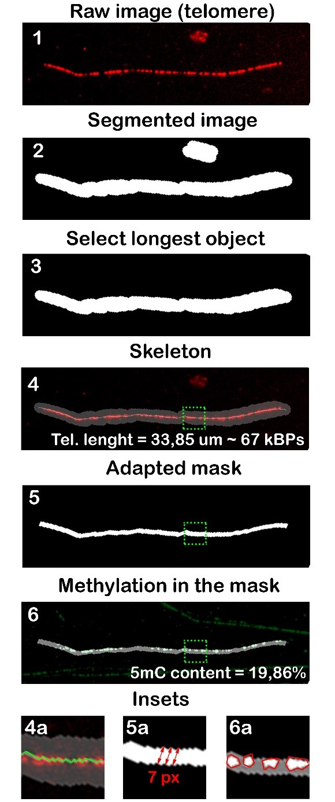
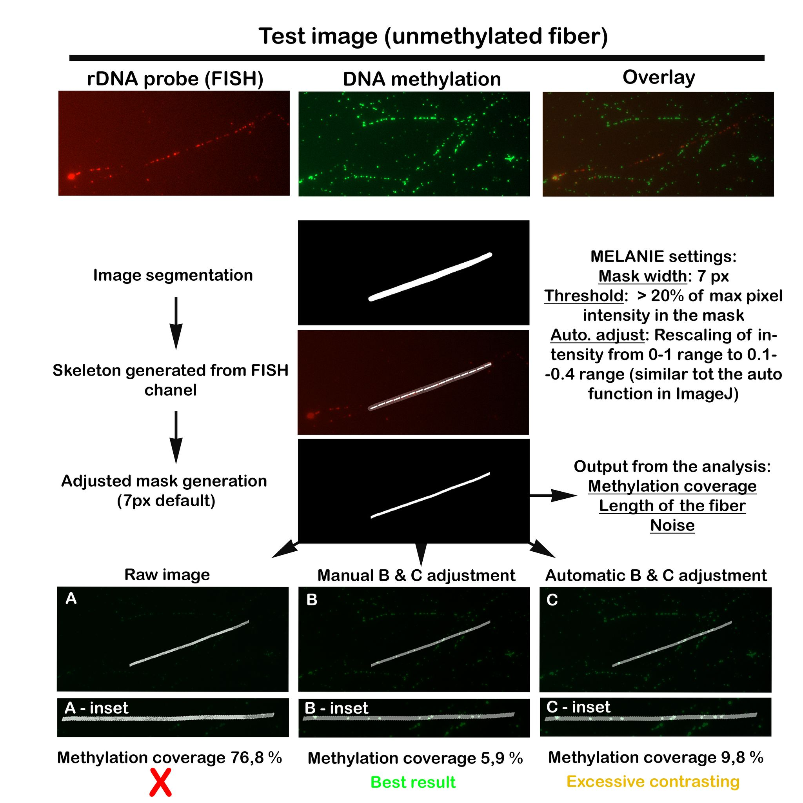

# MELANIE 

> MEthyLation Analysis iN fIbErs 

  

## Matlab script for quantitative DNA methylation analysis in fibres 

  

Since the analysis of methylation coverage on fibers is not straightforward, this script aimed to perform a quantitative evaluation of methylation along DNA fibres. Overall, individual fibers containing the FISH probe signal are cropped from raw data and both the methylation and FISH probe channels are exported. Then, the channel with the FISH signal is used for image segmentation in Matlab Image Segmenter to join the discrete signals along with the fiber. Afterwards, the longest object is selected in order to eliminate background signals. Skeleton is then constructed for the FISH signal, which can be used to estimate the length of the repeat and is used afterwards to generate the adapted mask. This mask is then applied to the methylation channel, where the methylation levels are calculated as the ratio of pixels in the mask with intensity higher than 25% of the maximum pixel intensity in the mask area.    

  

To see more and cite: *Franek M, Kilar A, Fojtík P, Olšinová M, Benda A, Rotrekl V, Dvořáčková M, Fajkus J. Super-resolution microscopy of chromatin fibers and quantitative DNA methylation analysis of DNA fiber preparations. J Cell Sci. 2021 Jul 9:jcs.258374. [doi: 10.1242/jcs.258374.](https://journals.biologists.com/jcs/article-abstract/doi/10.1242/jcs.258374/270857/Super-resolution-microscopy-of-chromatin-fibers?redirectedFrom=fulltext)*

   

### Depiction of key steps in the workflow for telomere measurement and methylation analysis.  

  

 

  

* Individual channels are exported from two colour images after thresholding (1). 

* The channel with FISH probe signal is then segmented (2) 

* in order to join the interrupted signals of the probe along with the fibre and the longest object is selected (3).  

* Skeleton of the longest object (4)  

* is then used to calculate the approximate length of the object and to generate a mask (5)  

* that is then used to evaluate methylation levels (6).  

* For clarity, the skeleton is highlighted with green lines in the inset (4a),  

* width of the adapted mask is indicated by red arrows (5a)  

* and the signals from 5mC antibody identified in the mask are highlighted in red (6a).  

  

kBPs – kilobase pairs, 5mC - 5-methylcytosine, px - pixels 

  

 ## Script overview 

 The script consists of two parts: 

1. Mask preparation, which requires manual mask preparation 

2. Analysis of methylation coverage, which performs all necessary computations 

  

### Mask preparation 

The first part aims to prepare the mask, based on theorientation of the fiber and its shape. The MATLAB toolbox called `imageSegmenter` starts automatically after executing the first part of the script. With the toolbox, it is possible to apply basic operations directly on the FISH probe image (See more in https://nl.mathworks.com/help/images/image-segmentation-using-the-image-segmenter-app.html). In our analysis, we used two tools originating from the toolbox: `Threshold` and `Morphology`. Using the option `Manual threshold` from `Threshold` tool, we can minimise the noise in the created binary image, which is necessary for the following steps. Then with tool `Morphology` by operations of dilation and erosion, we can easily define the mask.  The mask does not need to reflect the shape of the object precisely, since the calculation of the methylation coverage describedlater on uses a different mask. The point of the morphological operations is to join the discrete FISH signals an to filter out the longest object, which is the DNA fiber with the FISH signal. Once the shape of the mask is satisfactory, there is a need to export it to the Matlab Workspace as default, `Final Segmentation` result - `BW`.  

### Image adjustment, thresholding and noise ###

Images from different microscopes will have, by default, different brightness, contrast and signal to noise ratio. In order to properly evaluate the levels of methylation in an image, it is necessary to adjust the intensity of the methylation channel to minimize the background fluorescence in the image. This can be manually (for example, in the ImageJ software using the “auto” function in brightness & contrast tab) or automatically in MELANIE, by introducing `imadjust(RGB,[low_in high_in],___)` command in MATLAB. In the case of automatic adjustment, we recommend starting with values `[0.1 - 0.6]`. In case images are already of high intensity and low background, raw images can be used.  
For thresholding, the default setup only counts pixels in the mask that are above `20%` of the maximum intensity pixel in the mask. This value can be adjusted, depending on the results obtained from your data. The best rule of thumb is to observe the images generated by the script which show whether the foci corresponding to methylated parts of the fiber are properly marked in the methylation mask and based on this, adjust the threshold or the automatic adjustment values.    

For noisy images, we recommend narrowing down the mask width from `7 pixels` to a lower value and thus filtering out high intensity “noise” foci that occur in the proximity of the fiber. In order to have a quantitative estimation of noise in the image, we construct a mask in the proximity of the fiber (`18 pixels` wide) and count the signals in the methylation channel above the `20%` intensity threshold mentioned above. This calculates the degree of noise in percentage, which can then inform the user to narrow down the mask or subtract this value from the resulting methylation coverage. 

### Analysis of methylation coverage 

 Second part of the script computes the  length of the FISH signal and then calculates the methylation coverage. This part of the script starts with filtering out the longest object in the `BW` image which was created in the previous step. Once the object is defined, it is possible to measure its length with the usage of `bwskel` function that will draw the centerline of the object. By summarising centerline pixels, we can determine the  length of the object. Next, the centerline is used for the preparation of a mask. The mask is built by “thickening” the centerline, essentially widening the skeleton by a few pixels (`max_val`) to create tunnel-like shape. This mask is next overlayed with the methylation channel in order to calculate the coverage. In the area of the mask, the signal is thresholded (valid signal > 20%* of the maximum intensity pixel) to eliminate background and noise. The coverage formula is described as a valid signal/area of the mask, expressed in [%]. 

  

*As `perc` variable 

### Results 

The length of the telomere and the methylation coverage are automatically saved in the table. 

  

 #### Input files 

As input files, we recommend using images in `.png` format, preferably with manually enhanced contrast. From the raw, multi-channel data, the fibers labeled with the FISH probe are cropped. The channels are split after cropping to mantain the same size of the image.  

The file `table.txt` should be present in the working directory. 

#### Run 

Please insert the name of your image in lines: 

```m 

I = ['image_with_telomere_channel.png']; 

I2 = ['image_with_methylation_channel.png']; 

``` 

It also specifies parameters: `max_val` and `perc`, and allows for controlling enhancing methylation image.

#### Sucessful run

After a successful run, plots with particular steps of the analysis will appear inside the MATLAB environment. 

#### Output files 

##### 1. results.txt
The table will contain the image name, telomere length expressed in pixels, coverage and noise both expressed in percentage.  

##### 2. 9 control images in .png format

  
## Additional issues

 

